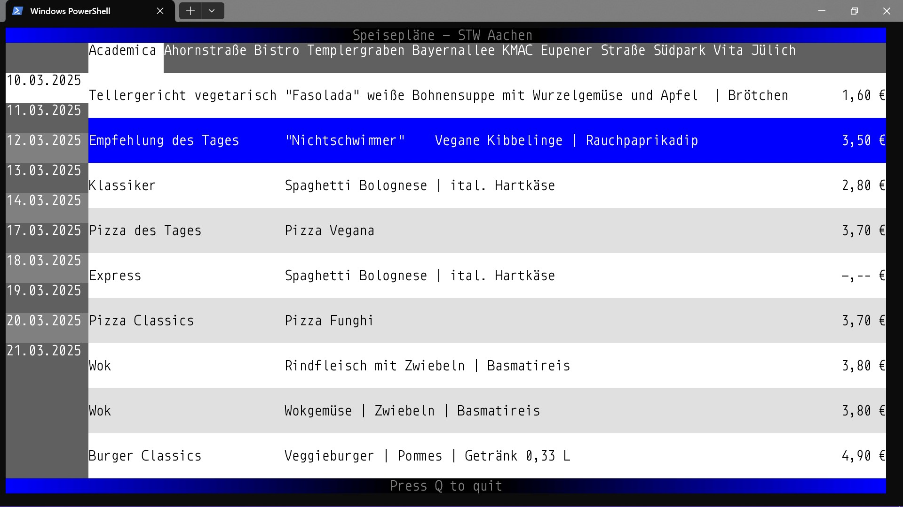

# Mensa

Mensa is a TUI-based desktop application for displaying the 
menu of student canteens of the Studierendenwerk (STW) Aachen.
The app is developed using [blessed](https://pypi.org/project/blessed/) 
for terminal interaction and
[beautifulsoup4](https://pypi.org/project/beautifulsoup4/) for web scraping.



## Running the app

* Clone the GitHub repository
* Install the dependencies as stated in [requirements.txt](requirements.txt)
* In terminal, navigate to the [scripts](scripts) subdirectory
* Run [run.bat](scripts/run.bat) (Windows CMD) or [run.ps1](scripts/run.ps1)
  (PowerShell)

If the last step is not working or your shell is not supported:
* In terminal, run [main.py](src/main.py). If the dependencies are
installed in a virtual environment, you need to activate it first by
running ````venv/Scripts/activate```` (the path and name may vary).

## Features
* Day selection
* Canteen selection
* Names that are too long to be displayed are scrolled
* Menu as well as day and canteen tabs can 
be scrolled if they don't wholly fit on the screen
* Dynamical TUI resizing